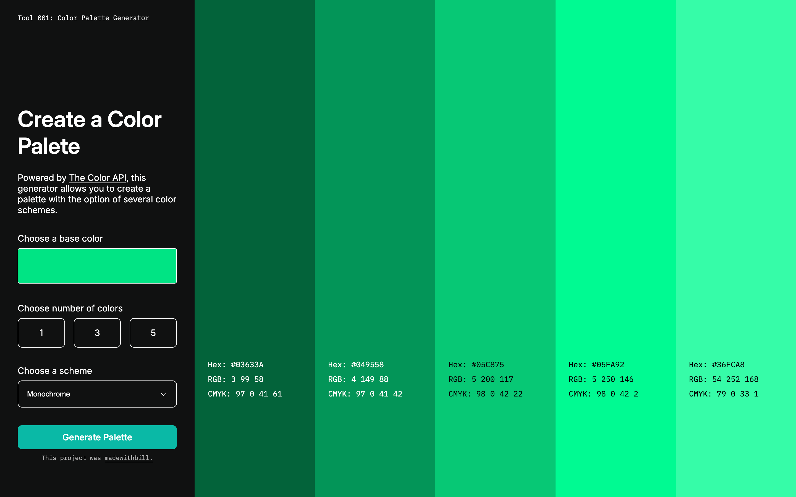

# Color Generator
Originating from a Scrimba project challenge, the goal of this app was to utilize [The Color API](https://www.thecolorapi.com/) to build a generator. After achieving the essential functionality with the first verison, I came back around to add some unique styling, responsiveness, and improved performance for a more polished product.

## Preview

## Key Features
- Choose a color with the color input, or refresh the page to get a random choice.
- Set your preferred number of colors to generate.
- Choose from from all 8 of The Color API's scheme options.
- Copy the hex codes of generated colors. Text color is set based on the calculated contrast of each block, improving the legibility of color details.

## Techniques and Technoloogies
- Full desktop and mobile layouts created in Figma to guide development.
- For loop for random hex code generation on page load before executing the API call.
- REST API call to to The Color API endpoint using dynamic parameters based on user inputs.
- DOM manipulation to append the HTML and styling of the palette.
- CSS media queries for simple responsiveness.

## Note
Design inspired by a brand deck slide from [strangelabs on Dribbble](https://dribbble.com/shots/25340565-neurolyze-BCI-Brain-Computer-Interface-Branding-Color-Palette).